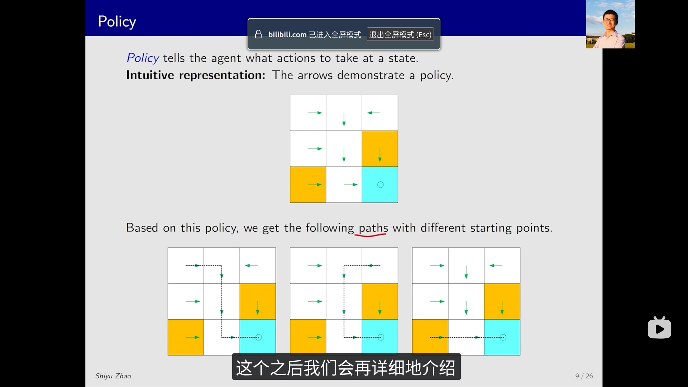
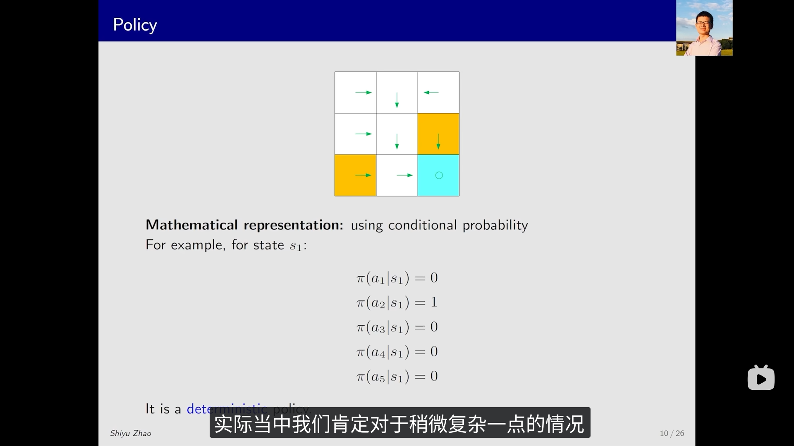
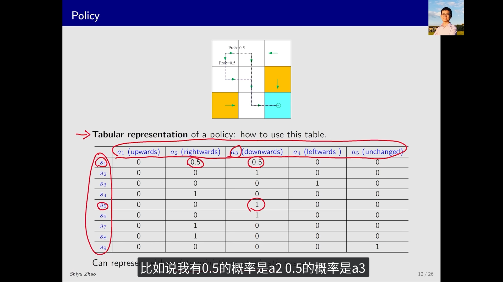
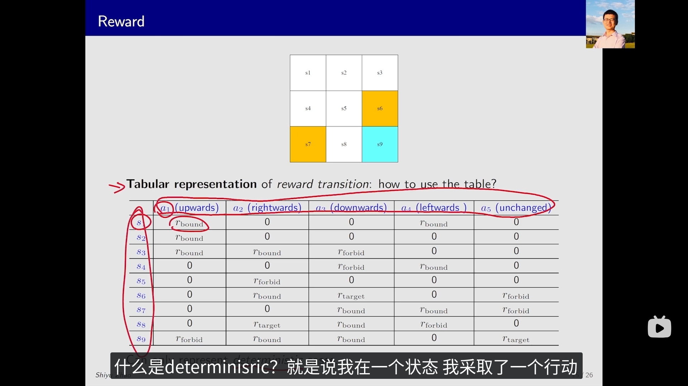
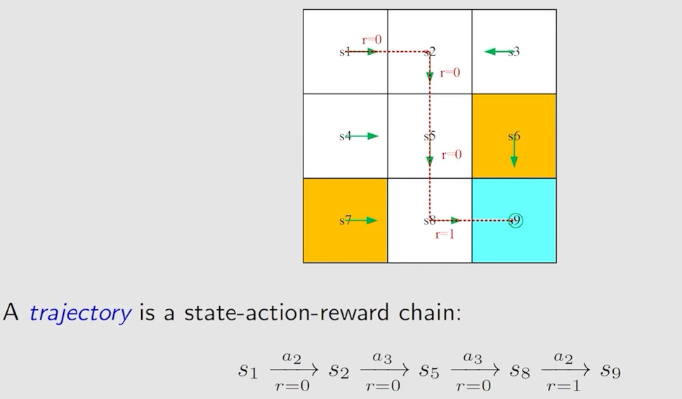

# Lecture 1: 基本概念（State, Action, Policy）

## 迷宫问题示例

> [!info] 环境设定
> - 网格世界 (Grid World)：每个格子是一个状态
> - 格子类型：**可通行** (accessible)、**禁止** (forbidden)、**目标** (target)、**边界** (boundary)

> [!task] 任务目标
> 给定任意起始位置，找到一条到达目标格子的"好"路径——避开禁止格、减少绕路、不越界。

---

## 状态 (State) 与状态空间 (State Space)

> [!note] 定义
> - **状态 $s$**：智能体相对于环境的状态描述（如迷宫中的位置）
> - **状态空间 $\mathcal{S}$**：所有状态的集合
> $$
> \mathcal{S} = \{s_i\}_{i=1}^{9}
> $$

> [!tip] 记号约定
> 使用 `\mathcal{S}`（花体字母）表示**集合**，小写字母表示集合中的**元素**。

---

## 动作 (Action) 与动作空间 (Action Space)

> [!note] 定义
> - **动作 $a$**：在每个状态下，智能体可以采取的一系列可能动作
>   - $a_1$: 向上 (up)
>   - $a_2$: 向下 (down)
>   - $a_3$: 向左 (left)
>   - $a_4$: 向右 (right)
>   - $a_5$: 原地不动 (stay)
> - **动作空间 $\mathcal{A}$**：所有动作的集合
> $$
> \mathcal{A} = \{a_i\}_{i=1}^{5}
> $$

---

## 状态转移 (State Transition)

> [!note] 定义
> **状态转移**：智能体通过执行动作，从一个状态移动到另一个状态的过程。
>
> 例如：$s_1 \xrightarrow{a_1} s_2$ 表示在状态 $s_1$ 选择动作 $a_1$（向上），智能体移动到状态 $s_2$。

> [!example] 确定性状态转移表
> 用表格定义状态转移关系（每个状态-动作对对应**唯一**的下一状态）：
>
> | - | $a_1$(向上) | $a_2$(向下) | $a_3$(向左) | $a_4$(向右) | $a_5$(停留) |
> |-----|---|---|---|---|---|
> | $s_1$ | $s_2$ | $s_4$ | - | $s_2$ | $s_1$ |
> | $s_2$ | $s_3$ | $s_1$ | $s_1$ | $s_3$ | $s_2$ |
> | $s_3$ | - | $s_2$ | $s_2$ | - | $s_3$ |
> | $s_4$ | $s_1$ | $s_7$ | - | $s_5$ | $s_4$ |
> | $s_5$ | $s_2$ | $s_8$ | $s_4$ | $s_6$ | $s_5$ |
> | $s_6$ | $s_3$ | $s_9$ | $s_5$ | - | $s_6$ |
> | $s_7$ | $s_4$ | - | - | $s_8$ | $s_7$ |
> | $s_8$ | $s_5$ | - | $s_7$ | $s_9$ | $s_8$ |
> | $s_9$ | $s_6$ | - | $s_8$ | - | $s_9$ |

> [!warning] 表格方法的局限
> 转移表**只能表示确定性的转移关系**。实际环境中存在大量不确定性（如机器人移动时可能打滑），需要用**概率**来描述状态转移。

---

## 状态转移概率 (State Transition Probability)

> [!note] 定义
> 使用概率来描述状态转移的不确定性。
>
> 直觉：在状态 $s_1$ 选择动作 $a_2$，下一状态为 $s_2$
>
> 数学描述：
> $$
> \begin{aligned}
> p(s_2|s_1, a_2) &= 1 \\
> p(s_i|s_1, a_2) &= 0, \quad \forall s_i \neq s_2
> \end{aligned}
> $$

> [!note] $p(s_2|s_1, a_2)$ 的含义
> 这是 MDP 中的**状态转移概率**，表示：在状态 $s_1$ 下执行动作 $a_2$ 后，转移到状态 $s_2$ 的概率。这里 $s_1, a_2$ **同时**作为条件。

> [!tip] 与条件概率 $p(A|B)$ 的关系
> $p(s_2|s_1, a_2)$ 本质上**就是条件概率**，只是条件从单个事件 $B$ 扩展到了 $(s_1, a_2)$ 这个**联合事件**。
> $$
> p(s_2|s_1, a_2) = \frac{p(s_2, s_1, a_2)}{p(s_1, a_2)}
> $$
>
> | | $p(A \mid B)$ | $p(s' \mid s, a)$ |
> |---|---|---|
> | 条件 | 单一事件 $B$ | 状态 $s$ **和** 动作 $a$ 同时给定 |
> | 本质 | 标准条件概率 | 条件是两个变量的组合 |

> [!important] 与联合概率 $p(A, B)$ 的区别
> - **联合概率** $p(s_2, s_1, a_2)$：三者**同时发生**的概率
> - **条件概率** $p(s_2|s_1, a_2)$：在 $s_1, a_2$ **已确定**的前提下，$s_2$ 发生的概率

> [!example] 确定性 vs 不确定性环境
> $p(s_2|s_1, a_2) = 1$ 意味着在 $s_1$ 执行 $a_2$ **确定性地**转移到 $s_2$，不可能转移到其他状态。
>
> 若环境存在不确定性（如打滑），则 $p(s'|s,a)$ 会在多个 $s'$ 上分布，例如：
> $$
> p(s_2|s_1, a_2) = 0.8, \quad p(s_4|s_1, a_2) = 0.2
> $$

---

## 策略 (Policy)

> [!note] 定义
> **策略 $\pi$**：告诉智能体在每个状态下应该采取什么动作。
>
> - **确定性策略**：$a = \pi(s)$，每个状态对应一个确定的动作
> - **随机策略**：$\pi(a|s)$，每个状态对应动作空间上的一个概率分布



我们使用 $\pi$ 来表示策略，$\pi(a|s)$ 表示在状态 $s$ 下选择动作 $a$ 的概率。对于确定性策略，$\pi(a|s)$ 在某个动作上为 1，其余为 0；对于随机策略，$\pi(a|s)$ 可以在多个动作上有非零概率。

> [!example] 确定性策略示例
> 在每个状态下，策略明确指定一个动作：
>
> 
>
> 例如：在状态 $s_1$，策略选择 $a_1$（向上），即 $\pi(a_1|s_1) = 1$，$\pi(a_i|s_1) = 0, \forall i \neq 1$。

> [!example] 随机策略示例
> 在每个状态下，策略给出动作的概率分布：
>
> 
>
> 例如：在状态 $s_1$，$\pi(a_1|s_1) = 0.7$，$\pi(a_2|s_1) = 0.3$，其余动作为 0。

---

## 从概率分布中采样

> [!question] 如何从策略的概率分布中采样动作？
> 当策略是随机策略时，我们需要根据概率分布来选择动作。常用的方法是**转盘法**（Roulette Wheel Selection）。

> [!note] 转盘法 (Roulette Wheel Selection)
> **核心思想**：将概率分布想象成一个转盘，每个动作占据与其概率成比例的扇形区域，然后"转动转盘"随机选取。
>
> **算法步骤**：
> 1. 生成一个 $[0, 1)$ 上的均匀随机数 $u \sim \text{Uniform}(0, 1)$
> 2. 按动作顺序累加概率，找到第一个使累积概率超过 $u$ 的动作
>
> $$
> a = \arg\min_{a'} \left\{ \sum_{a'' \leq a'} \pi(a''|s) \geq u \right\}
> $$

> [!example] 转盘法示例
> 假设在状态 $s_1$，策略为：
> | 动作 | $a_1$ | $a_2$ | $a_3$ | $a_4$ |
> |---|---|---|---|---|
> | 概率 | 0.4 | 0.3 | 0.2 | 0.1 |
>
> **转盘划分**：
> ```
> |-- a_1 (0.4) --|-- a_2 (0.3) --|-- a_3 (0.2) --|-- a_4 (0.1) --|
> 0             0.4             0.7             0.9              1.0
> ```
>
> **采样过程**：
> - 生成随机数 $u = 0.55$
> - 累加：$0.4 < 0.55$，$0.4 + 0.3 = 0.7 \geq 0.55$
> - 选择动作 $a_2$

> [!tip] 实现方式
> 在代码中，可以使用 `numpy.random.choice` 实现：
> ```python
> import numpy as np
> actions = ['up', 'down', 'left', 'right']
> probs = [0.4, 0.3, 0.2, 0.1]
> action = np.random.choice(actions, p=probs)
> ```

---

## 确定性策略 vs 随机策略的对比

| 特性 | 确定性策略 $a = \pi(s)$ | 随机策略 $\pi(a|s)$ |
|---|---|---|
| 输出 | 单一动作 | 动作的概率分布 |
| 表示 | $\pi(a^*|s) = 1$，其余为 0 | $\sum_a \pi(a|s) = 1$ |
| 探索性 | 无（需要额外机制如 $\epsilon$-greedy） | 天然具有随机性 |
| 适用场景 | 简单环境、离散动作空间 | 复杂环境、连续动作空间 |
| 采样 | 直接取 $\pi(s)$ | 需要从分布中采样（如转盘法） |

---

## 状态转移与策略的关系

> [!important] 从状态转移概率到策略
> 状态转移概率 $p(s'|s,a)$ 描述的是**环境的动态特性**——给定状态和动作，环境如何变化。
>
> 策略 $\pi(a|s)$ 描述的是**智能体的行为方式**——给定状态，智能体如何选择动作。
>
> 两者结合，可以计算**在策略 $\pi$ 下从状态 $s$ 转移到状态 $s'$ 的概率**：
> $$
> p(s'|s) = \sum_a \pi(a|s) \cdot p(s'|s,a)
> $$
>
> 这个公式将**智能体的选择**与**环境的随机性**统一起来，是后续 Bellman 方程的基础。

---

## 奖励 (Reward)

> [!note] 定义
> **奖励 $r$**：智能体执行动作后从环境中获得的一个**实数**反馈。
>
> - **正奖励** (positive)：鼓励智能体继续采取类似动作
> - **负奖励** (negative)：阻止智能体采取类似动作

> [!question] 零奖励意味着什么？
> - 零奖励 ≠ 惩罚，它只是表示"没有反馈"
> - 正奖励是否可以表示惩罚？**可以**——奖励的含义完全由设计者决定（奖励工程，reward engineering）

> [!tip] 奖励是人-机交互的接口
> 奖励是人类向智能体**传达目标**的唯一方式。智能体无法直接理解"什么是好的行为"，只能通过奖励信号来学习。因此，奖励函数的设计至关重要。

奖励也可以用表格来表示：



> [!example] 奖励的概率描述
> 与状态转移类似，奖励也可以用**条件概率**描述：
>
> 直觉：在状态 $s_1$ 选择动作 $a_1$，奖励为 $-1$。
>
> 数学描述：
> $$
> \begin{aligned}
> p(r = -1 \mid s_1, a_1) &= 1 \\
> p(r \neq -1 \mid s_1, a_1) &= 0
> \end{aligned}
> $$

> [!warning] 奖励的随机性
> 以上是**确定性**的情况。实际中奖励也可以是**随机的**：
> 例如：努力学习 → 会得到奖励，但奖励多少是不确定的（考试成绩有波动）。
>
> 此时需要使用**奖励转移概率** $p(r|s,a)$ 来描述。

---

## 轨迹 (Trajectory) 与回报 (Return)

> [!note] 轨迹 (Trajectory)
> **轨迹**是一条状态-动作-奖励的序列链：
> $$
> s_0 \xrightarrow{a_0} r_1, s_1 \xrightarrow{a_1} r_2, s_2 \xrightarrow{a_2} r_3, s_3 \xrightarrow{a_3} r_4, \ldots
> $$



> [!note] 回报 (Return)
> **回报**是从某时刻开始，所有未来奖励的**总和**：
> $$
> G_t = r_{t+1} + r_{t+2} + r_{t+3} + \cdots
> $$

> [!example] 回报计算示例
> 对于上面的轨迹，回报为：
> $$
> G_0 = 0 + 0 + 0 + 1 = 1
> $$

> [!important] 回报的意义
> 回报衡量了**一个策略的好坏**。我们的目标是让智能体学会一个策略 $\pi$，使得它在环境中能够获得**更高的回报**。
>
> 这也是 RL 的核心优化目标：**最大化期望回报**。

---

## 折扣回报 (Discounted Return)

> [!question] 为什么需要折扣？
> 考虑一条无限长的轨迹：
> $$
> s_1 \xrightarrow{a_1} s_2 \xrightarrow{a_2} s_3 \xrightarrow{a_3} s_4 \xrightarrow{a_4} \cdots
> $$
> 此时回报为：
> $$
> G_t = r_1 + r_2 + r_3 + r_4 + \cdots
> $$
> 这个求和可能**发散**到无穷大，使得回报的定义失效。

> [!note] 折扣回报 (Discounted Return)
> 引入**折扣因子** $\gamma \in [0, 1)$，定义折扣回报：
> $$
> G_t = r_{t+1} + \gamma \, r_{t+2} + \gamma^2 \, r_{t+3} + \cdots = \sum_{k=0}^{\infty} \gamma^k \, r_{t+k+1}
> $$

> [!tip] 折扣因子 $\gamma$ 的两个作用
>
> **1. 保证求和收敛**：由于 $\gamma < 1$，即使有无限多步，折扣回报也是有限的。
>
> **2. 平衡近期与远期奖励**：
> - $\gamma \approx 0$：**短视**——只关注眼前的奖励
> - $\gamma \approx 1$：**远视**——重视长远的奖励
>
> | $\gamma$ 值 | 含义 | 类比 |
> |---|---|---|
> | $\gamma = 0$ | 只看即时奖励 | "立即享受" |
> | $\gamma = 0.9$ | 兼顾短期和长期 | 常用默认值 |
> | $\gamma \to 1$ | 几乎等价于未折扣 | "延迟享受" |

---

## 回合任务与持续任务

> [!note] 回合任务 (Episodic Task)
> 轨迹是**有限的**，存在终止状态（terminal state）。这样的轨迹称为一个**回合 (episode)**。
>
> 例如：走迷宫（到达目标即结束）、下棋（分出胜负即结束）、一局游戏。

> [!note] 持续任务 (Continuing Task)
> 没有终止状态，智能体与环境的交互**永远不会结束**。
>
> 例如：服务器的负载均衡、股票交易机器人。

> [!important] 统一处理两种任务
> 在本课程中，我们用一种统一的数学方式来处理回合任务和持续任务——将回合任务转化为持续任务。
>
> **方法一（吸收状态法）**：将目标状态视为一个特殊的**吸收状态 (absorbing state)**。一旦到达吸收状态，智能体永远不会离开，后续奖励全部为零。
>
> **方法二（本课程采用）**：将目标状态视为一个**普通状态**，仍然有策略 $\pi(a|s)$。智能体可以离开目标状态，进入目标状态时获得奖励 $r = \pm 1$。
>
> 这样我们无需区分目标状态和其他状态，数学处理更简洁。

---

## 马尔可夫决策过程 (MDP)

> [!note] MDP 的定义
> **马尔可夫决策过程 (Markov Decision Process)** 是 RL 问题的数学框架，由以下要素组成：

### 要素一：集合 (Sets)

| 符号 | 含义 | 说明 |
|---|---|---|
| $\mathcal{S}$ | 状态集合 | 所有可能的状态 |
| $\mathcal{A}$ | 动作集合 | 与状态 $s \in \mathcal{S}$ 相关联的动作集 |
| $\mathcal{R}(s,a)$ | 奖励集合 | 在状态 $s$ 执行动作 $a$ 可能获得的奖励 |

### 要素二：概率 (Probabilities)

| 符号 | 含义 | 说明 |
|---|---|---|
| $p(s'\|s,a)$ | 状态转移概率 | 在 $s$ 执行 $a$ 后转移到 $s'$ 的概率 |
| $p(r\|s,a)$ | 奖励转移概率 | 在 $s$ 执行 $a$ 后获得奖励 $r$ 的概率 |

### 要素三：策略 (Policy)

$$
\pi(a|s) = P(A_t = a \mid S_t = s)
$$

在状态 $s$ 下选择动作 $a$ 的概率。

### 要素四：马尔可夫性质 (Markov Property)

> [!important] 马尔可夫性质——无记忆性
> 下一状态和奖励**只依赖于当前状态和动作**，与历史无关：
> $$
> \begin{aligned}
> p(s_{t+1} \mid a_{t+1}, s_t, a_t, \ldots, a_1, s_0) &= p(s_{t+1} \mid a_{t+1}, s_t) \\
> p(r_{t+1} \mid a_{t+1}, s_t, a_t, \ldots, a_1, s_0) &= p(r_{t+1} \mid a_{t+1}, s_t)
> \end{aligned}
> $$

> [!tip] 直觉理解
> 马尔可夫性质意味着"**当前状态包含了预测未来所需的全部信息**"。
> 一旦知道了 $s_t$ 和 $a_t$，之前发生的一切（$s_0, a_0, s_1, a_1, \ldots$）都不再重要。
>
> 类比：下棋时，当前棋盘局面已经包含了所有决策所需的信息，不需要知道每一步的历史。

---

## 总结

> [!summary] Lecture 1 核心概念
>
> **基本要素**：
> - **状态 $s$** 与**状态空间 $\mathcal{S}$**：环境的描述
> - **动作 $a$** 与**动作空间 $\mathcal{A}$**：智能体的行为
> - **奖励 $r$**：环境对行为的反馈信号
>
> **动态模型**：
> - **状态转移概率** $p(s'|s,a)$：环境如何变化
> - **奖励转移概率** $p(r|s,a)$：获得多少奖励
>
> **序列概念**：
> - **轨迹**：状态-动作-奖励的序列
> - **回报 $G_t$**：未来奖励的总和（衡量策略好坏的指标）
> - **折扣回报** $\sum_{k=0}^{\infty} \gamma^k r_{t+k+1}$：带折扣因子的回报
>
> **任务类型**：
> - **回合任务**：有终止状态，轨迹有限
> - **持续任务**：无终止状态，交互永续
>
> **数学框架**：
> - **MDP** = $(\mathcal{S}, \mathcal{A}, p(s'|s,a), p(r|s,a), \gamma)$ + 马尔可夫性质
> - **策略 $\pi(a|s)$**：智能体的行为方式（连接智能体与环境的桥梁）
