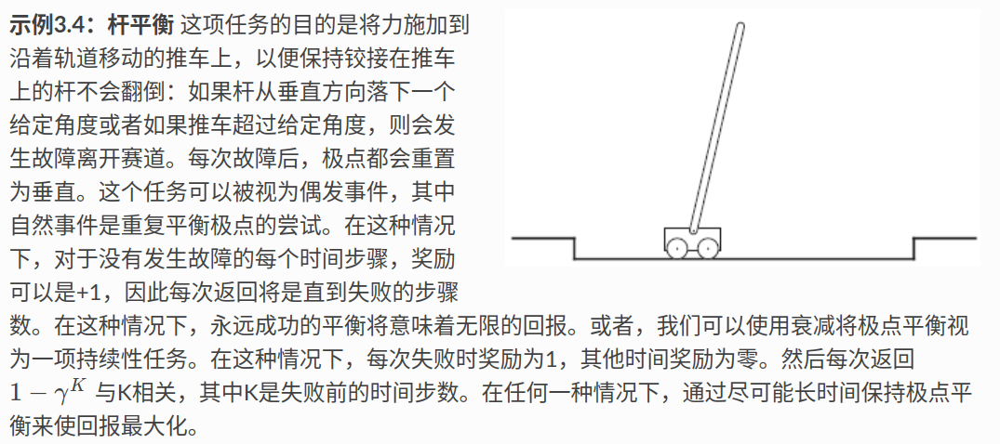

# 有限马尔科夫决策过程（Finite MDP）

> [!abstract] 概述
> MDP 是顺序决策的经典形式化，其中行动不仅影响直接奖励，还影响后续状态，以及贯穿到未来的奖励。因此 MDP 涉及延迟奖励以及交换即时与延迟奖励的需要。
>
> 与老虎机问题不同，MDP 中我们估计每个状态 $s$ 中每个动作 $a$ 的价值 $q_*(s,a)$，或者估计给出最佳行动的每个状态价值 $v_*(s)$。

---

## 3.1 个体-环境接口

> [!info] 核心思想
> 强化学习中的学习者/决策者称为**智能体（agent）**，智能体交互的一切称为**环境（environment）**。二者在离散时间步上持续交互。

> [!important] 交互过程
> 每个时间步 $t$，智能体接收环境状态 $S_t \in \mathcal{S}$，并在此基础上选择动作 $A_t \in \mathcal{A}(S_t)$。之后智能体接收到奖励 $R_{t+1} \in \mathcal{R} \subset \mathbb{R}$，并进入新状态 $S_{t+1}$。
>
> MDP 和智能体一起产生交互序列：
> $$S_0, A_0, R_1, S_1, A_1, R_2, S_2, A_2, R_3, \dots$$

> [!note] 有限 MDP 的定义
> 在**有限 MDP** 中，集合 $\mathcal{S}$、$\mathcal{A}$、$\mathcal{R}$ 都是有限的。随机变量 $R_t$ 和 $S_t$ 具有明确定义的离散概率分布，仅取决于前一个状态和动作：
>
> $$p(s',r|s,a) \doteq \Pr\{S_t = s', R_t = r \mid S_{t-1} = s, A_{t-1} = a\}$$
>
> > 其中 $\doteq$ 表示"定义为"。函数 $p$ 定义了 MDP 的**动力学（dynamics）**。

> [!tip] 概率归一性
> 动力学函数 $p: \mathcal{S} \times \mathcal{R} \times \mathcal{S} \times \mathcal{A} \to [0,1]$ 满足：
> $$\sum_{s'\in \mathcal{S}} \sum_{r \in \mathcal{R}} p(s',r|s,a) = 1, \quad \text{for all } s\in \mathcal{S},\ a\in \mathcal{A}(s)$$

### 从动力学函数推导的派生量

> [!note] 状态转移概率（三参数）
> $$p(s'|s,a) \doteq \Pr\{S_t=s' \mid S_{t-1}=s, A_{t-1}=a\} = \sum_{r \in \mathcal{R}} p(s',r|s,a)$$

> [!note] 状态-动作对的期望奖励（双参数）
> $$r(s,a) \doteq \mathbb{E}[R_t \mid S_{t-1}=s, A_{t-1}=a] = \sum_{r \in \mathcal{R}} r \sum_{s' \in \mathcal{S}} p(s',r|s,a)$$

> [!note] 状态-动作-下一状态三元组的期望奖励（三参数）
> $$r(s,a,s') \doteq \mathbb{E}[R_t \mid S_{t-1}=s, A_{t-1}=a, S_t=s'] = \sum_{r\in \mathcal{R}} r \frac{p(s',r|s,a)}{p(s'|s,a)}$$

> [!warning] 智能体-环境边界
> 智能体-环境边界通常比物理边界更靠近智能体。对于机器人，电机和机械连杆属于环境；对于人类，肌肉、骨骼和感觉器官属于环境。**一般规则是：智能体不能随意更改的任何事物都是其环境的一部分。**

### 示例

> [!example] 示例 3.1：生物反应器
> 强化学习确定生物反应器的目标温度和搅拌速率。
> - **状态**：热电偶读数（经过滤/延迟）、其他传感器读数、关于容器和目标化学组成的符号输入
> - **动作**：目标温度和搅拌速率
> - **奖励**：生产有用化学品的每小时速率
>
> 状态是列表/向量，动作是向量，但**奖励始终是一个数字**。

> [!example] 示例 3.2：拾取放置机器人
> 强化学习控制机器人手臂进行重复的拾取放置任务。
> - **状态**：最新的关节角度和速度读数
> - **动作**：每个关节电机的电压
> - **奖励**：每次成功拾取放置得 +1，每个时间步根据瞬时加加速度（jerk）给予小的负奖励以鼓励平滑运动

> [!example] 示例 3.3：回收机器人 ⭐
> 一个在办公环境中收集空易拉罐的移动机器人。基于当前电池电量进行高层决策。
>
> - **状态集合**：$\mathcal{S} = \{\text{high}, \text{low}\}$
> - **动作集合**：$\mathcal{A}(\text{high}) = \{\text{search}, \text{wait}\}$，$\mathcal{A}(\text{low}) = \{\text{search}, \text{wait}, \text{recharge}\}$
> - **奖励**：收集到空罐得 +1，电池耗尽被救得 -3
>
> **转移规则**：
> - 电量**高**时搜索：以概率 $\alpha$ 保持高，以概率 $1-\alpha$ 降为低
> - 电量**低**时搜索：以概率 $\beta$ 保持低，以概率 $1-\beta$ 耗尽电池
>
> 该系统是一个有限 MDP，可用**转移图**表示：大圆圈为状态节点，小实心圆为动作节点，箭头标记转移概率 $p(s'|s,a)$ 和期望奖励 $r(s,a,s')$。

---

## 3.2 马尔科夫性质

> [!important] 马尔科夫性质
> 在马尔科夫决策过程中，概率 $p$ 完全刻画了环境的动态特性——$S_t$ 和 $R_t$ **仅依赖于紧邻的前一个状态和动作** $S_{t-1}$ 和 $A_{t-1}$。
>
> $$\Pr\{S_t, R_t \mid S_{t-1}, A_{t-1}\} = \Pr\{S_t, R_t \mid S_0, A_0, S_1, A_1, \dots, S_{t-1}, A_{t-1}\}$$

> [!tip] 对状态的启示
> 这应被视为对**决策过程**的限制，而不是对状态的限制。状态必须包含关于过去智能体-环境交互中与未来相关的所有信息；此时它具有**马尔科夫性质**。

---

## 3.3 目标和奖励

> [!info] 奖励假设
> 我们所说的目标和目的，都可以被很好地理解为最大化接收到的标量信号（称为**奖励**）的累积和的期望值。

> [!important] 设计奖励的原则
> - 奖励信号应传达**你想达成什么**，而不是**如何达成**
> - 奖励信号不是传授关于如何完成目标的先验知识的地方
>
> 例如：国际象棋智能体应只因获胜而获得奖励，不应因子目标（如吃子或控制中心）而获得奖励。

---

## 3.4 回报和情节

> [!info] 回报（Return）的定义
> 智能体的目标是最大化期望**回报**。在最简单的情况下，回报是未来奖励的总和：
> $$G_t \doteq R_{t+1} + R_{t+2} + R_{t+3} + \dots + R_T$$
> 其中 $T$ 是最终时间步。

### 情节性任务（Episodic Tasks）

> [!note] 情节性任务
> 当智能体-环境交互自然地分解为子序列时，这些子序列称为**情节（episodes）**（如博弈、迷宫遍历）。每个情节在特殊的**终止状态**结束，随后被重置。
>
> 我们有时将所有非终止状态的集合 $\mathcal{S}$ 与所有状态加终止状态的集合 $\mathcal{S}^+$ 加以区分。终止时间 $T$ 是一个随情节变化的随机变量。

### 持续性任务（Continuing Tasks）

> [!warning] 问题
> 对于交互持续不断、没有情节的任务，$T = \infty$，回报可能是无穷大。

> [!important] 折扣回报
> 引入**折扣因子** $\gamma$（$0 \leq \gamma \leq 1$），智能体选择 $A_t$ 以最大化期望折扣回报：
>
> $$G_t \doteq R_{t+1} + \gamma R_{t+2} + \gamma^2 R_{t+3} + \dots = \sum_{k=0}^{\infty} \gamma^k R_{t+k+1}$$
>
> - **$\gamma = 0$**：智能体是**短视的**，只关注最大化立即奖励
> - **$\gamma \to 1$**：目标回报更强烈地考虑未来回报，智能体变得**更有远见**
>
> 如果 $\gamma < 1$，且奖励序列 $\{R_k\}$ 有界，则无穷级数是有限的。

> [!tip] 折扣回报的递推关系
> 连续回报之间存在递推关系：
> $$G_t = R_{t+1} + \gamma G_{t+1}$$
>
> **推导**：
> $$G_t = R_{t+1} + \gamma R_{t+2} + \gamma^2 R_{t+3} + \gamma^3 R_{t+4} + \dots$$
> $$= R_{t+1} + \gamma (R_{t+2} + \gamma R_{t+3} + \gamma^2 R_{t+4} + \dots)$$
> $$= R_{t+1} + \gamma G_{t+1}$$
>
> 对所有 $t < T$ 成立，即使在 $t+1$ 处终止也成立（定义 $G_T = 0$）。

> [!example] 常数奖励的回报
> 如果奖励恒为 +1，则折扣回报为：
> $$G_t = \sum_{k=0}^{\infty} \gamma^k = \frac{1}{1-\gamma}$$

> [!example] 示例 3.4：杆平衡
> 
>
> **情节性处理**：奖励 +1（每步未失败），回报 = 失败前的步数
>
> **持续性处理**：失败时奖励 1，否则 0，回报 $1 - \gamma^K$（$K$ 为失败前的步数）
>
> 无论哪种方式，最大化回报意味着尽可能长时间保持杆平衡。

---

## 3.5 情节和持续任务的统一符号

> [!info] 统一记号
> 为同时处理情节性和持续性任务，将情节终止视为进入一个特殊的**吸收状态**，该状态只能转移到自身且奖励为零。
>
> 使用统一的回报定义：
> $$G_t \doteq \sum_{k=t+1}^{T} \gamma^{k-t-1} R_k$$
>
> 包括 $T=\infty$ 或 $\gamma=1$ 的可能性（但不能同时为 $T=\infty$ 且 $\gamma=1$）。

---

## 3.6 策略和价值函数

> [!info] 策略（Policy）
> **策略**是从状态到选择每个可能动作的概率的映射。如果智能体在时间 $t$ 遵循策略 $\pi$，则 $\pi(a|s)$ 是智能体在状态 $s$ 下选择动作 $a$ 的概率。

> [!important] 状态价值函数（State-Value Function）
> 状态 $s$ 在策略 $\pi$ 下的价值 $v_\pi(s)$，是从 $s$ 出发、遵循 $\pi$ 所获得的期望回报：
>
> $$v_\pi(s) \doteq \mathbb{E}_\pi[G_t \mid S_t = s] = \mathbb{E}_\pi\left[\sum_{k=0}^{\infty} \gamma^k R_{t+k+1} \;\middle|\; S_t = s\right], \quad \forall s \in \mathcal{S}$$
>
> 其中 $\mathbb{E}_\pi[\cdot]$ 表示在智能体遵循策略 $\pi$ 条件下的期望值。终止状态的价值为 0。

> [!important] 动作价值函数（Action-Value Function）
> 动作价值函数 $q_\pi(s,a)$ 定义为：
>
> $$q_\pi(s,a) \doteq \mathbb{E}_\pi[G_t \mid S_t = s, A_t = a] = \mathbb{E}_\pi\left[\sum_{k=0}^{\infty} \gamma^k R_{t+k+1} \;\middle|\; S_t = s, A_t = a\right]$$

> [!tip] $v_\pi$ 与 $q_\pi$ 的关系
> $$v_\pi(s) = \sum_a \pi(a|s) \, q_\pi(s,a)$$
> $$q_\pi(s,a) = \sum_{s',r} p(s',r|s,a) \left[r + \gamma \, v_\pi(s')\right]$$

---

## 3.7 Bellman 方程

> [!important] Bellman 方程（$v_\pi$）
> 价值函数满足递推关系。对任意策略 $\pi$ 和任意状态 $s$，以下一致性条件成立：
>
> $$v_\pi(s) = \sum_a \pi(a|s) \sum_{s', r} p(s', r | s, a) \left[r + \gamma \, v_\pi(s')\right], \quad \forall s \in \mathcal{S}$$
>
> **推导过程**：
> $$v_\pi(s) \doteq \mathbb{E}_\pi[G_t \mid S_t = s]$$
> $$= \mathbb{E}_\pi[R_{t+1} + \gamma G_{t+1} \mid S_t = s]$$
> $$= \sum_a \pi(a|s) \sum_{s'} \sum_r p(s', r | s, a) \left[r + \gamma \, \mathbb{E}_\pi[G_{t+1} \mid S_{t+1} = s']\right]$$
> $$= \sum_a \pi(a|s) \sum_{s', r} p(s', r | s, a) \left[r + \gamma \, v_\pi(s')\right]$$
>
> > 起始状态的价值必须等于期望下一状态的（折扣）价值加上沿途的期望奖励。

> [!note] Bellman 方程的意义
> - $v_\pi$ 是其 Bellman 方程的**唯一解**
> - 这些 Bellman 方程构成了计算、近似和学习 $v_\pi$ 的方法的基础
> - 展示这些关系的图称为**备份图（backup diagrams）**，因为更新/备份操作将价值信息从后继状态传回当前状态

> [!tip] $q_\pi$ 的 Bellman 方程
> $$q_\pi(s,a) = \sum_{s',r} p(s',r|s,a) \left[r + \gamma \sum_{a'} \pi(a'|s') \, q_\pi(s',a')\right]$$

> [!example] 示例 3.5：网格世界（Gridworld）
> 一个简单的矩形网格世界：
> - 网格单元对应状态，每个单元有 4 个动作（北、南、东、西）
> - 试图走出网格的动作使位置不变，奖励 -1
> - 特殊状态 A 的所有动作得 +10 并转移到 $A'$
> - 特殊状态 B 的所有动作得 +5 并转移到 $B'$
> - 其他动作奖励 0
>
> 以等概率选择四个动作时，$\gamma = 0.9$ 的价值函数 $v_\pi$ 显示：
> - 靠近底部边缘的状态价值为负（高概率撞到网格边缘）
> - 状态 A 的价值最高（但低于立即奖励 10，因为有可能移到网格边缘）
> - 状态 B 的价值超过立即奖励 5（因为 $B'$ 有正价值）

> [!example] 示例 3.6：高尔夫
> 将高尔夫表述为强化学习任务：
> - 每次击球惩罚 -1，直到球进洞
> - 状态价值 = 从该位置进洞所需杆数的负值
> - 动作 = 选择球杆（推杆 putter 或驱动杆 driver）
>
> **推杆策略** $v_{\text{putt}}(s)$：洞是终止状态（价值 0），果岭上任何位置价值 -1（一推进洞）。等高线在 -2、-3 等处显示需要额外推杆的位置。沙坑价值 $-\infty$（推杆无法逃脱）。

---

## 3.8 最优策略和最优价值函数

> [!info] 策略的偏序关系
> 策略之间存在偏序关系：$\pi \geq \pi'$ 当且仅当 $v_\pi(s) \geq v_{\pi'}(s)$ 对所有 $s \in \mathcal{S}$ 成立。

> [!important] 最优策略
> 对于有限 MDP，总是存在至少一个策略优于或等于所有其他策略——**最优策略 $\pi_*$**。所有最优策略共享相同的**最优状态价值函数** $v_*$ 和**最优动作价值函数** $q_*$：
>
> $$v_*(s) \doteq \max_\pi v_\pi(s), \quad \forall s \in \mathcal{S}$$
> $$q_*(s,a) \doteq \max_\pi q_\pi(s,a), \quad \forall s \in \mathcal{S},\ a \in \mathcal{A}(s)$$

> [!tip] $q_*$ 与 $v_*$ 的关系
> $$q_*(s,a) = \mathbb{E}\left[R_{t+1} + \gamma \, v_*(S_{t+1}) \mid S_t = s, A_t = a\right]$$

---

## 3.9 Bellman 最优方程

> [!important] Bellman 最优方程（$v_*$）
> $$v_*(s) = \max_{a \in \mathcal{A}(s)} \sum_{s', r} p(s', r | s, a) \left[r + \gamma \, v_*(s')\right]$$
>
> **推导**：
> $$v_*(s) = \max_a q_{\pi_*}(s,a)$$
> $$= \max_a \mathbb{E}_{\pi_*}[R_{t+1} + \gamma G_{t+1} \mid S_t = s, A_t = a]$$
> $$= \max_a \mathbb{E}[R_{t+1} + \gamma \, v_*(S_{t+1}) \mid S_t = s, A_t = a]$$
> $$= \max_{a \in \mathcal{A}(s)} \sum_{s', r} p(s', r | s, a) \left[r + \gamma \, v_*(s')\right]$$

> [!important] Bellman 最优方程（$q_*$）
> $$q_*(s,a) = \sum_{s', r} p(s', r | s, a) \left[r + \gamma \max_{a'} q_*(s', a')\right]$$

> [!note] Bellman 最优方程的性质
> - 对于有限 MDP，$v_*$ 的 Bellman 最优方程有**唯一解**
> - 如果有 $n$ 个状态，就是 $n$ 个方程 $n$ 个未知数的方程组
> - 如果环境动力学 $p$ 已知，可用各种非线性方程组求解方法
>
> > 这三个假设在实践中很少满足：(1) 准确的环境动力学知识，(2) 足够的计算资源，(3) 马尔科夫性质。

> [!tip] 最优策略的获取
> 一旦找到 $v_*$，确定最优策略就很直接：
> - 对每个状态，选择在 Bellman 最优方程中达到最大值的动作
> - 任何只给这些动作分配非零概率的策略都是最优的
> - 这是**单步前瞻搜索**
>
> > **$v_*$ 的精妙之处**：用它来评估短期后果（单步前瞻），贪心策略实际上在长期意义上是最优的，因为 $v_*$ 已经考虑了所有可能的未来动作-奖励序列。

> [!tip] $q_*$ 的优势
> 拥有 $q_*$ 使选择最优动作更容易——智能体**不需要**单步前瞻搜索，只需找到最大化 $q_*(s,a)$ 的动作。动作价值函数有效地缓存了所有单步前瞻搜索的结果。

> [!example] 示例 3.7：高尔夫的最优策略
> 最优动作价值函数 $q_*(s, \text{driver})$ 显示：
> - 驱动杆的更长但精度更低的击球使得从更远的地方可以用更少的杆数到达洞口
> - -1 等高线仅覆盖果岭的一小部分（一杆进洞）
> - -2 等高线更大，显示可以用一次驱动杆到达果岭然后推杆进洞的区域
> - -3 等高线包括起始发球台
> - 从发球台的最优策略：两次驱动杆 + 一次推杆 = 三杆

> [!example] 示例 3.8：求解网格世界
> 对网格任务求解 $v_*$ 的 Bellman 方程，得到最优价值函数和对应的最优策略。在有多个箭头的单元格中，对应的动作都是最优的。

> [!example] 示例 3.9：回收机器人的 Bellman 最优方程
> 使用简写 **h**（高）、**l**（低）、**s**（搜索）、**w**（等待）、**re**（充电）：
>
> $$v_*(h) = \max\left\{ r_s + \gamma[\alpha \, v_*(h) + (1-\alpha) \, v_*(l)], \quad r_w + \gamma \, v_*(h) \right\}$$
>
> $$v_*(l) = \max\left\{ \beta \, r_s - 3(1-\beta) + \gamma[(1-\beta) \, v_*(h) + \beta \, v_*(l)], \quad r_w + \gamma \, v_*(l), \quad \gamma \, v_*(h) \right\}$$
>
> 对于任何 $r_s$、$r_w$、$\alpha$、$\beta$、$\gamma$ 的选择（$0 \leq \gamma < 1$，$0 \leq \alpha, \beta \leq 1$），恰好有一对数字 $v_*(h)$ 和 $v_*(l)$ 同时满足这两个非线性方程。

---

## 3.10 最优性与近似

> [!warning] 实践中的挑战
> 学习最优策略是理想的，但在实践中很少能实现。
>
> 即使有完整准确的环境模型，通过求解 Bellman 最优方程来计算最优策略通常也是不可能的——例如国际象棋尽管只是人类经验的很小一部分，但即使大型定制计算机也无法计算出最优动作。
>
> **关键约束**：
> - **计算资源**：可用的计算量，特别是单个时间步内能执行的计算量
> - **内存**：对于小的有限状态集，可用表格方法；实际感兴趣的任务需要紧凑的参数化函数近似

> [!tip] 强化学习的优势
> 强化学习的在线性质使其能够以对频繁遇到的状态做出好决策的方式来近似最优策略，同时在罕见状态上花费很少的努力——这将强化学习与其他近似求解 MDP 的方法区分开来。

---

## 3.11 总结

> [!abstract] 本章要点
> 1. **强化学习**是从交互中学习如何行动以实现目标
> 2. **智能体**和**环境**通过离散时间步交互：动作是选择，状态是选择的基础，奖励是评价
> 3. **策略** $\pi$ 是智能体根据状态选择动作的随机规则
> 4. **有限 MDP** 具有有限的状态、动作和奖励集合
> 5. **回报**是智能体试图最大化的未来奖励的函数
>    - 情节性任务：交互分解为情节
>    - 持续性任务：使用折扣因子
> 6. **价值函数**为状态或状态-动作对分配期望回报
> 7. **最优价值函数**分配任何策略可达到的最大期望回报
> 8. **Bellman 最优方程**是最优价值函数必须满足的一致性条件
> 9. 任何对最优价值函数贪心的策略都是最优策略

---

## 重要公式汇总

> [!info] 核心公式速查
>
> | 公式 | 名称 |
> |------|------|
> | $p(s',r\|s,a) = \Pr\{S_t=s', R_t=r \mid S_{t-1}=s, A_{t-1}=a\}$ | 动力学函数 |
> | $p(s'\|s,a) = \sum_r p(s',r\|s,a)$ | 状态转移概率 |
> | $G_t = R_{t+1} + \gamma G_{t+1}$ | 回报递推 |
> | $v_\pi(s) = \sum_a \pi(a\|s) \sum_{s',r} p(s',r\|s,a)[r + \gamma v_\pi(s')]$ | Bellman 方程（$v_\pi$） |
> | $q_\pi(s,a) = \sum_{s',r} p(s',r\|s,a)[r + \gamma \sum_{a'} \pi(a'\|s') q_\pi(s',a')]$ | Bellman 方程（$q_\pi$） |
> | $v_*(s) = \max_a \sum_{s',r} p(s',r\|s,a)[r + \gamma v_*(s')]$ | Bellman 最优方程（$v_*$） |
> | $q_*(s,a) = \sum_{s',r} p(s',r\|s,a)[r + \gamma \max_{a'} q_*(s',a')]$ | Bellman 最优方程（$q_*$） |
> | $v_\pi(s) = \sum_a \pi(a\|s) q_\pi(s,a)$ | $v_\pi$ 与 $q_\pi$ 关系 |
> | $v_*(s) = \max_a q_*(s,a)$ | $v_*$ 与 $q_*$ 关系 |
